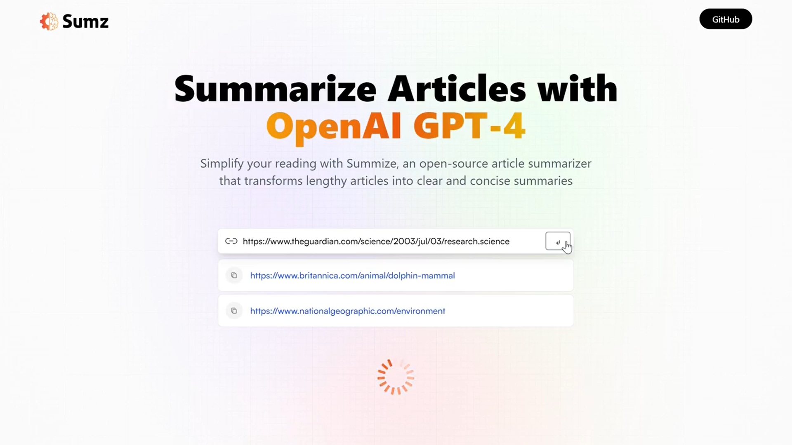

# OpenAI GPT-4 Summarizer Application :page_with_curl:

This is an article summarizer application that uses OpenAI's GPT model. It allows users to input an article URL and generates a summary of the article using advanced RTK query API requests that fire on condition. :rocket:

## Demo :movie_camera:

Click [here](https://drive.google.com/file/d/1v4E7WcqtBDIBDxOcgTS-_FOAgnYglsls/preview) to view a demo of the application. :eyes:

## Screenshot :camera:

## Technologies Used :computer:

- React.js :atom_symbol:
- Vite :zap:
- Tailwind CSS :art:
- RapidAPI summarize API :cloud:

## Features :star:

- Responsive, beautiful UI/UX with a nice touch of glass morphism using Tailwind CSS :sparkles:
- Advanced RTK query API requests that fire on condition (RapidAPI summarize API) :fire:
- History saved using local storage :floppy_disk:
- Form event handling and error catching :bug:
- Copy to clipboard functionality :clipboard:
- Clean code :100:

## Getting Started :rocket:

To get started with the application, follow these steps:

1. Clone the repository
2. Install dependencies by running `npm install`
3. Start the development server by running `npm run dev`
4. Open `http://localhost:3000` in your web browser :globe_with_meridians:

## Usage :bulb:

To use the application, follow these steps:

1. Enter the URL of the article you want to summarize :link:
2. Click the "Summarize" button :arrow_right_hook:
3. View the summary generated by the application :eyes:
4. Click the "Copy" button to copy the summary to your clipboard :clipboard:
5. View your previous searches by clicking the "History" button :clock3:

## Conclusion :tada:

This application provides a convenient way to generate article summaries using OpenAI's GPT model. Its advanced RTK query API requests, clean code, and responsive UI make it a great tool for summarizing articles quickly and easily. :raised_hands:
